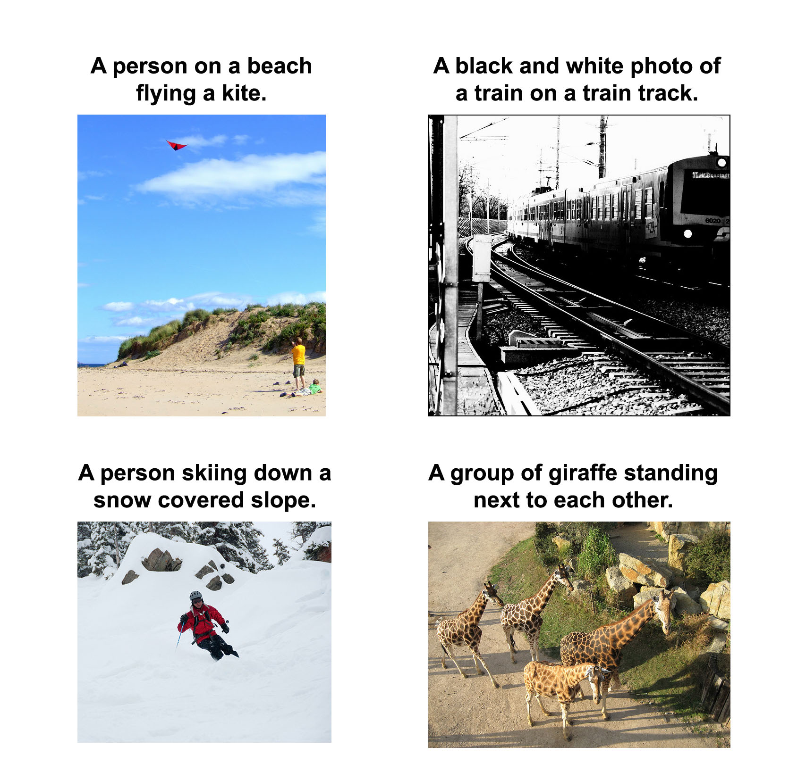

# Note:

This repo aims to provide a **Ready-to-Go** settup for **Image Captioning Inference** using pre-trained model. For training from scratch or funetuning, please refer to [Tensorflow Model Repo](https://github.com/tensorflow/models/tree/master/research/im2txt).

# Show and Tell: A Neural Image Caption Generator

A TensorFlow implementation of the image-to-text model described in the paper:

"Show and Tell: Lessons learned from the 2015 MSCOCO Image Captioning
Challenge."

Oriol Vinyals, Alexander Toshev, Samy Bengio, Dumitru Erhan.

*IEEE transactions on pattern analysis and machine intelligence (2016).*

Full text available at: http://arxiv.org/abs/1609.06647

## Contents
* [Model Overview](#model-overview)
    * [Introduction](#introduction)
    * [Architecture](#architecture)
* [Requirement](#getting-started)
    * [Install](#install-required-packages)
    * [Get Pre-trained Model][#get-pretrained-model]
* [Generating Captions](#generating-captions)

## Model Overview

### Introduction

The *Show and Tell* model is a deep neural network that learns how to describe
the content of images. For example:



### Architecture
Please refer to the original [Tensorflow Model](https://github.com/tensorflow/models/tree/master/research/im2txt).

## Requirement

### Install Required Packages
First ensure that you have installed the following required packages:

* **TensorFlow** 1.0 or greater ([instructions](https://www.tensorflow.org/install/))
* **NumPy** ([instructions](http://www.scipy.org/install.html))
* **Natural Language Toolkit (NLTK)**:
    * First install NLTK ([instructions](http://www.nltk.org/install.html))
    * Then install the NLTK data package "punkt" ([instructions](http://www.nltk.org/data.html))

OR you can use the given `requirement.txt` and run `pip install -r requirement.txt` in your CLI 
to get all packages needed.

### Get Pre-trained Model
[inceptionv3 finetuned parameters over 1M](https://drive.google.com/open?id=1xl0QqAtQY_dyiGF6yIz2lNQn1pMfgdDM)

## Generating Captions

Your trained *Show and Tell* model can generate captions for any JPEG image! The
following command line will generate captions for an image from the test set.
```shell
python im2txt/run_inference.py --checkpoint_path="im2txt/model/Hugh/train/newmodel.ckpt-2000000" --vocab_file="im2txt/data
/Hugh/word_counts.txt" --input_files="im2txt/data/images/test.jpg"
```

Example output:
```shell
Captions for image test.jpg:
  0) a young boy wearing a hat and a tie . <S> <S> . <S> <S> . <S> <S> (p=0.000014)
  1) a young boy wearing a tie and a hat . <S> <S> . <S> <S> . <S> <S> (p=0.000012)
  2) a young boy wearing a tie and a hat . <S> <S> <S> . <S> <S> . <S> (p=0.000008)
```

Note: you may get different results. Some variation between different models is
expected.

Here is the image:


