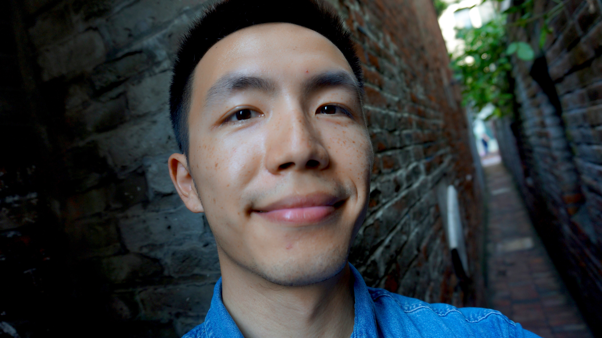

# Show and Tell: A Neural Image Caption Generator

A TensorFlow implementation of the image-to-text model described in the paper:

"Show and Tell: Lessons learned from the 2015 MSCOCO Image Captioning
Challenge."

Oriol Vinyals, Alexander Toshev, Samy Bengio, Dumitru Erhan.

*IEEE transactions on pattern analysis and machine intelligence (2016).*

Full text available at: http://arxiv.org/abs/1609.06647

## Contents
* [Model Overview](#model-overview)
    * [Introduction](#introduction)
    * [Architecture](#architecture)
* [Requirement](#getting-started)
    * [Install](#Install Required Packages)
    * [Get Model Parameters][#Get Model Parameters]
* [Generating Captions](#generating-captions)

## Model Overview

### Introduction

The *Show and Tell* model is a deep neural network that learns how to describe
the content of images. For example:


### Architecture

The *Show and Tell* model is an example of an *encoder-decoder* neural network.
It works by first "encoding" an image into a fixed-length vector representation,
and then "decoding" the representation into a natural language description.

The image encoder is a deep convolutional neural network. This type of
network is widely used for image tasks and is currently state-of-the-art for
object recognition and detection. Our particular choice of network is the
[*Inception v3*](http://arxiv.org/abs/1512.00567) image recognition model
pretrained on the
[ILSVRC-2012-CLS](http://www.image-net.org/challenges/LSVRC/2012/) image
classification dataset.

The decoder is a long short-term memory (LSTM) network. This type of network is
commonly used for sequence modeling tasks such as language modeling and machine
translation. In the *Show and Tell* model, the LSTM network is trained as a
language model conditioned on the image encoding.

Words in the captions are represented with an embedding model. Each word in the
vocabulary is associated with a fixed-length vector representation that is
learned during training.

The following diagram illustrates the model architecture.


In this diagram, \{*s*<sub>0</sub>, *s*<sub>1</sub>, ..., *s*<sub>*N*-1</sub>\}
are the words of the caption and \{*w*<sub>*e*</sub>*s*<sub>0</sub>,
*w*<sub>*e*</sub>*s*<sub>1</sub>, ..., *w*<sub>*e*</sub>*s*<sub>*N*-1</sub>\}
are their corresponding word embedding vectors. The outputs \{*p*<sub>1</sub>,
*p*<sub>2</sub>, ..., *p*<sub>*N*</sub>\} of the LSTM are probability
distributions generated by the model for the next word in the sentence. The
terms \{log *p*<sub>1</sub>(*s*<sub>1</sub>),
log *p*<sub>2</sub>(*s*<sub>2</sub>), ...,
log *p*<sub>*N*</sub>(*s*<sub>*N*</sub>)\} are the log-likelihoods of the
correct word at each step; the negated sum of these terms is the minimization
objective of the model.

During the first phase of training the parameters of the *Inception v3* model
are kept fixed: it is simply a static image encoder function. A single trainable
layer is added on top of the *Inception v3* model to transform the image
embedding into the word embedding vector space. The model is trained with
respect to the parameters of the word embeddings, the parameters of the layer on
top of *Inception v3* and the parameters of the LSTM. In the second phase of
training, all parameters - including the parameters of *Inception v3* - are
trained to jointly fine-tune the image encoder and the LSTM.

Given a trained model and an image we use *beam search* to generate captions for
that image. Captions are generated word-by-word, where at each step *t* we use
the set of sentences already generated with length *t* - 1 to generate a new set
of sentences with length *t*. We keep only the top *k* candidates at each step,
where the hyperparameter *k* is called the *beam size*. We have found the best
performance with *k* = 3.

## Requirement

### Install Required Packages
First ensure that you have installed the following required packages:

* **TensorFlow** 1.0 or greater ([instructions](https://www.tensorflow.org/install/))
* **NumPy** ([instructions](http://www.scipy.org/install.html))
* **Natural Language Toolkit (NLTK)**:
    * First install NLTK ([instructions](http://www.nltk.org/install.html))
    * Then install the NLTK data package "punkt" ([instructions](http://www.nltk.org/data.html))

OR you can use the given `requirement.txt` and run `pip install -r requirement.txt` in your CLI 
to get all packages needed.

### Get Pre-trained Model Parameters
[inceptionv3 finetuned parameters over 1M](https://drive.google.com/open?id=1xl0QqAtQY_dyiGF6yIz2lNQn1pMfgdDM)

## Generating Captions

Your trained *Show and Tell* model can generate captions for any JPEG image! The
following command line will generate captions for an image from the test set.
```shell
python im2txt/run_inference.py --checkpoint_path="im2txt/model/Hugh/train/newmodel.ckpt-2000000" --vocab_file="im2txt/data
/Hugh/word_counts.txt" --input_files="im2txt/data/images/test.jpg"
```

Example output:
```shell
Captions for image test.jpg:
  0) a young boy wearing a hat and a tie . <S> <S> . <S> <S> . <S> <S> (p=0.000014)
  1) a young boy wearing a tie and a hat . <S> <S> . <S> <S> . <S> <S> (p=0.000012)
  2) a young boy wearing a tie and a hat . <S> <S> <S> . <S> <S> . <S> (p=0.000008)
```

Note: you may get different results. Some variation between different models is
expected.

Here is the image:


